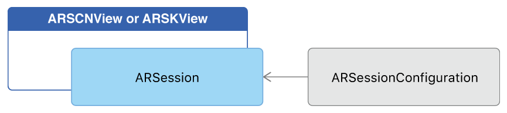

# Building Your First AR Experience

Create an app that runs an AR session and uses plane detection to place 3D content using SceneKit.   

## Overview

This sample app runs an [ARKit][0] world tracking session with content displayed in a SceneKit view. To demonstrate plane detection, the app simply places an [`SCNPlane`][13] object to visualize each detected [`ARPlaneAnchor`][14] object.

[0]:https://developer.apple.com/documentation/arkit
[13]:https://developer.apple.com/documentation/scenekit/scnplane
[14]:https://developer.apple.com/documentation/arkit/arplaneanchor

## Getting Started

ARKit requires iOS 11 and a device with an A9 (or later) processor. ARKit is not available in iOS Simulator. Building the sample code requires Xcode 9 or later.

## Configure and Run the AR Session

The [`ARSCNView`][1] class is a SceneKit view that includes an [`ARSession`][2] object that manages the motion tracking and image processing required to create an augmented reality (AR) experience. However, to run a session you must provide a session configuration.

[1]:https://developer.apple.com/documentation/arkit/arscnview
[2]:https://developer.apple.com/documentation/arkit/arsession



The [`ARWorldTrackingConfiguration`][3] class provides high-precision motion tracking and enables features to help you place virtual content in relation to real-world surfaces. To start an AR session, create a session configuration object with the options you want (such as plane detection), then call the [`run(_:options:)`][4] method on the [`session`][5] object of your [`ARSCNView`][1] instance:

``` swift
let configuration = ARWorldTrackingConfiguration()
configuration.planeDetection = .horizontal
sceneView.session.run(configuration)
```
[View in Source](x-source-tag://StartARSession)

[3]:https://developer.apple.com/documentation/arkit/arworldtrackingconfiguration
[4]:https://developer.apple.com/documentation/arkit/arsession/2875735-run
[5]:https://developer.apple.com/documentation/arkit/arscnview/2865796-session

Run your session only when the view that will display it is onscreen.

> **Important:** If your app requires ARKit for its core functionality, use the `arkit` key in the [`UIRequiredDeviceCapabilities`][7] section of your app's `Info.plist` file to make your app available only on devices that support ARKit. If AR is a secondary feature of your app, use the [`isSupported`][8] property to determine whether to offer AR-based features.

[7]:https://developer.apple.com/library/content/documentation/General/Reference/InfoPlistKeyReference/Articles/iPhoneOSKeys.html#//apple_ref/doc/uid/TP40009252-SW3
[8]:https://developer.apple.com/documentation/arkit/arconfiguration/2923553-issupported

## Place 3D Content for Detected Planes

After you’ve set up your AR session, you can use SceneKit to place virtual content in the view.

When plane detection is enabled, ARKit adds and updates anchors for each detected plane. By default, the [`ARSCNView`][1] class adds an [`SCNNode`][9] object to the SceneKit scene for each anchor. Your view's delegate can implement the [`renderer(_:didAdd:for:)`][10] method to add content to the scene.

``` swift
func renderer(_ renderer: SCNSceneRenderer, didAdd node: SCNNode, for anchor: ARAnchor) {
       // Place content only for anchors found by plane detection.
       guard let planeAnchor = anchor as? ARPlaneAnchor else { return }

       // Create a SceneKit plane to visualize the plane anchor using its position and extent.
       let plane = SCNPlane(width: CGFloat(planeAnchor.extent.x), height: CGFloat(planeAnchor.extent.z))
       let planeNode = SCNNode(geometry: plane)
       planeNode.simdPosition = float3(planeAnchor.center.x, 0, planeAnchor.center.z)
       
       /*
        `SCNPlane` is vertically oriented in its local coordinate space, so
        rotate the plane to match the horizontal orientation of `ARPlaneAnchor`.
       */
       planeNode.eulerAngles.x = -.pi / 2
       
       // Make the plane visualization semitransparent to clearly show real-world placement.
       planeNode.opacity = 0.25
       
       /*
        Add the plane visualization to the ARKit-managed node so that it tracks
        changes in the plane anchor as plane estimation continues.
       */
       node.addChildNode(planeNode)
}
```
[View in Source](x-source-tag://PlaceARContent)

[9]:https://developer.apple.com/documentation/scenekit/scnnode
[10]:https://developer.apple.com/documentation/arkit/arscnviewdelegate/2865794-renderer

If you add content as a child of the node corresponding to the anchor, the `ARSCNView` class automatically moves that content as ARKit refines its estimate of the plane's position and extent. To show the full extent of the estimated plane, this sample app also implements the [`renderer(_:didUpdate:for:`][11] method, updating the [`SCNPlane`][12] object's size to reflect the esitmate provided by ARKit.

``` swift
func renderer(_ renderer: SCNSceneRenderer, didUpdate node: SCNNode, for anchor: ARAnchor) {
    // Update content only for plane anchors and nodes matching the setup created in `renderer(_:didAdd:for:)`.
    guard let planeAnchor = anchor as?  ARPlaneAnchor,
        let planeNode = node.childNodes.first,
        let plane = planeNode.geometry as? SCNPlane
        else { return }
    
    // Plane estimation may shift the center of a plane relative to its anchor's transform.
    planeNode.simdPosition = float3(planeAnchor.center.x, 0, planeAnchor.center.z)
    
    /*
     Plane estimation may extend the size of the plane, or combine previously detected
     planes into a larger one. In the latter case, `ARSCNView` automatically deletes the
     corresponding node for one plane, then calls this method to update the size of
     the remaining plane.
    */
    plane.width = CGFloat(planeAnchor.extent.x)
    plane.height = CGFloat(planeAnchor.extent.z)
}
```
[View in Source](x-source-tag://UpdateARContent)

[11]:https://developer.apple.com/documentation/arkit/arscnviewdelegate/2865799-renderer
[12]:https://developer.apple.com/documentation/scenekit/scnplane

